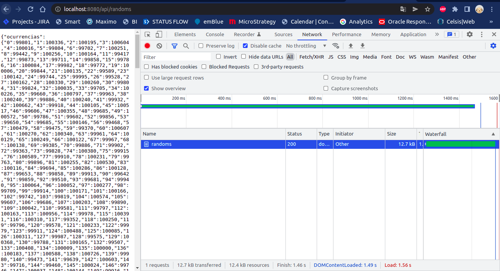
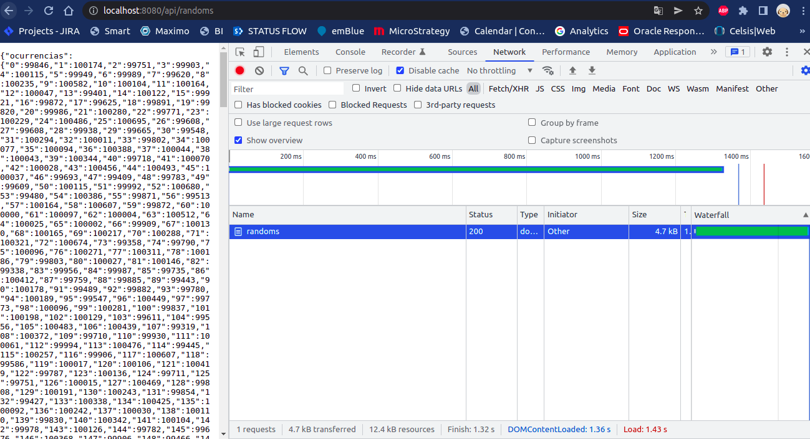
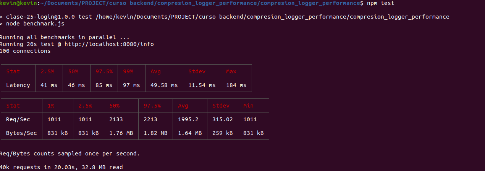
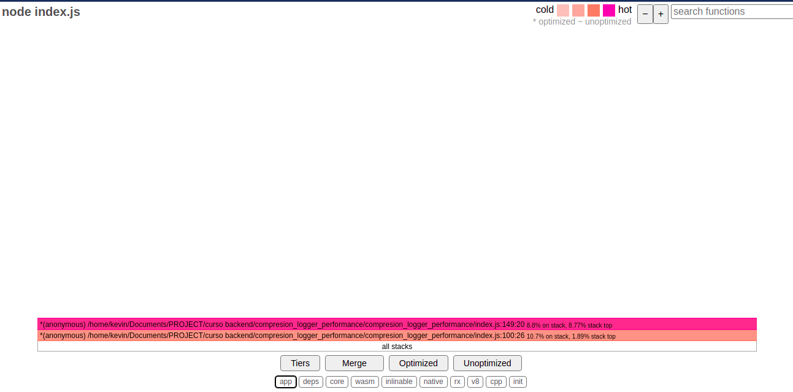
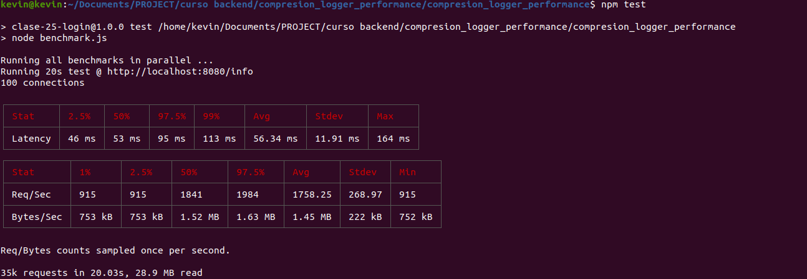
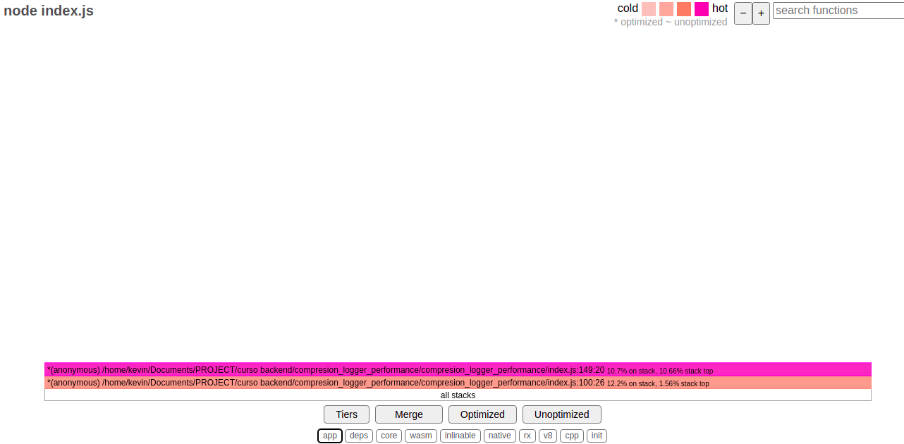

# Ejercicio gzip, logger y análisis de performance

Este repositorio usa express y persiste las sesiones de usuarios en mongo atlas.
También permite el login mediante Facebook.

## Run

$  node index.js -p {PORT_NUMBER} [-m cluster]


Para selección del puerto mediante arg: -p {PORT_NUMBER}
Para correr el server en modo cluster se debe agregar el argumento: -m cluster

## Análisis

### Compresión 

Sin compresión, tamaño de respuesta de /api/randoms



Con compresión, tamaño de respuesta de /api/randoms



### Profiling Nativo

Sin console log en /info

```
 [Summary]:
   ticks  total  nonlib   name
     28    1.9%   12.9%  JavaScript
    187   12.9%   86.2%  C++
     41    2.8%   18.9%  GC
   1235   85.1%          Shared libraries
      2    0.1%          Unaccounted

```


Con console log en /info

```
 [Summary]:
   ticks  total  nonlib   name
     35    2.0%   16.4%  JavaScript
    178   10.3%   83.2%  C++
     77    4.5%   36.0%  GC
   1511   87.6%          Shared libraries
```

El detalle compelto se encuentra en la ruta [./performance/profiling_nativo](./performance/profiling_nativo)

### 0x con autocannon

**Sin console log en /info**

Output de autocannon:



Análisis de 0x



**Con console log en /info**

Output de autocannon:



Análisis de 0x



Los html se en encuentran en la ruta [./performance/0x](./performance/0x)