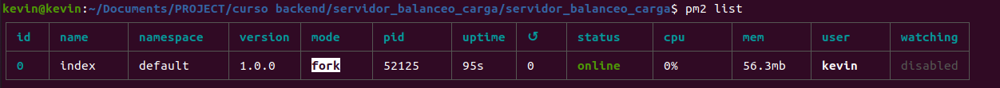
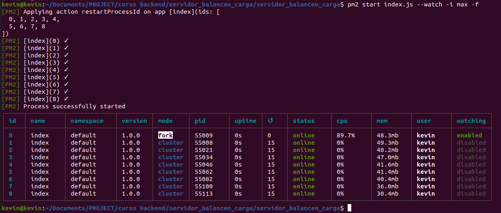

# Ejercicio Balanceo de Carga

Este repositorio usa express y persiste las sesiones de usuarios en mongo atlas.
También permite el login mediante Facebook.

## Run

$  node index.js -p {PORT_NUMBER} [-m cluster]


Para selección del puerto mediante arg: -p {PORT_NUMBER}
Para correr el server en modo cluster se debe agregar el argumento: -m cluster

## Output del las diferentes invocaciones


### NODEMON


$  nodemon index.js -p 8081 -m cluster

```
[nodemon] 2.0.12
[nodemon] to restart at any time, enter `rs`
[nodemon] watching path(s): *.*
[nodemon] watching extensions: js,mjs,json
[nodemon] starting `node index.js -p 8081 -m cluster`
8
PID MASTER 50476
[PID: 50500] Servidor express escuchando en el puerto 8081
[PID: 50488] Servidor express escuchando en el puerto 8081
[PID: 50487] Servidor express escuchando en el puerto 8081
[PID: 50494] Servidor express escuchando en el puerto 8081
[PID: 50507] Servidor express escuchando en el puerto 8081
[PID: 50528] Servidor express escuchando en el puerto 8081
[PID: 50514] Servidor express escuchando en el puerto 8081
[PID: 50517] Servidor express escuchando en el puerto 8081
```

$ ps -e|grep node
```
50456 pts/0    00:00:00 node
50476 pts/0    00:00:00 node
50487 pts/0    00:00:00 node
50488 pts/0    00:00:00 node
50494 pts/0    00:00:00 node
50500 pts/0    00:00:00 node
50507 pts/0    00:00:00 node
50514 pts/0    00:00:00 node
50517 pts/0    00:00:00 node
50528 pts/0    00:00:00 node
```

$ node index.js -p 8081 -m cluster

```
PID MASTER 50889
[PID: 50902] Servidor express escuchando en el puerto 8081
[PID: 50903] Servidor express escuchando en el puerto 8081
[PID: 50910] Servidor express escuchando en el puerto 8081
[PID: 50896] Servidor express escuchando en el puerto 8081
[PID: 50931] Servidor express escuchando en el puerto 8081
[PID: 50924] Servidor express escuchando en el puerto 8081
[PID: 50943] Servidor express escuchando en el puerto 8081
[PID: 50916] Servidor express escuchando en el puerto 8081
```

$ ps -e|grep node

```
50889 pts/0    00:00:00 node
50896 pts/0    00:00:00 node
50902 pts/0    00:00:00 node
50903 pts/0    00:00:00 node
50910 pts/0    00:00:00 node
50916 pts/0    00:00:00 node
50924 pts/0    00:00:00 node
50931 pts/0    00:00:00 node
50943 pts/0    00:00:00 node
```

### FOREVER

$ forever start index.js -p 8081 -m cluster

$ forever list

```
info:    Forever processes running
data:        uid  command                                          script                      forever pid   id logfile                       uptime       
data:    [0] Sv6m /home/kevin/.nvm/versions/node/v14.17.6/bin/node index.js -p 8081 -m cluster 51369   51376    /home/kevin/.forever/Sv6m.log 0:0:0:21.265 
```

$ ps -e|grep node
```
  51369 ?        00:00:00 node
  51376 ?        00:00:00 node
  51383 ?        00:00:00 node
  51389 ?        00:00:00 node
  51390 ?        00:00:00 node
  51397 ?        00:00:00 node
  51403 ?        00:00:00 node
  51410 ?        00:00:00 node
  51418 ?        00:00:00 node
  51425 ?        00:00:00 node
```

### PM2

**Modo fork:**

$ pm2 start index.js

$  pm2 list



**Modo cluster:**

$ pm2 start index.js --watch -i max



## NGINX


Configuración NGINX:

**Config 1, ambos server en modo fork:**


```
$ pm2 start index.js -- --p=8080 
$ pm2 start index.js -- --p=8081 
```

Se redirige las consultas a /api/randoms al puerto 8081, el resto al puerto 8080

```
upstream node_app {
		server 127.0.0.1:8080;
}

upstream node_app_api_randoms {
		server 127.0.0.1:8081;
}

server {
	listen 80 default_server;
	listen [::]:80 default_server;


	root /var/www/nginx;

	server_name _;

	location /api/randoms {
		proxy_pass http://node_app_api_randoms;
	}

	location / {
		proxy_pass http://node_app;
	}

  }
}

```

**Config 2, redirección /api/randoms en cluster gestionado por NGINX:**

```
$ pm2 start index.js -- --p=8080 
$ pm2 start index.js -- --p=8081 
$ pm2 start index.js -- --p=8082 
$ pm2 start index.js -- --p=8083
$ pm2 start index.js -- --p=8084
```

```
upstream node_app {
		server 127.0.0.1:8080;
}

upstream node_app_api_randoms {
    server 127.0.0.1:8081;
    server 127.0.0.1:8082;
    server 127.0.0.1:8083;
    server 127.0.0.1:8084;
}

server {
	listen 80 default_server;
	listen [::]:80 default_server;


	root /var/www/nginx;

	server_name _;

	location /api/randoms {
		proxy_pass http://node_app_api_randoms;
	}

	location / {
		proxy_pass http://node_app;
	}

  }
}

```